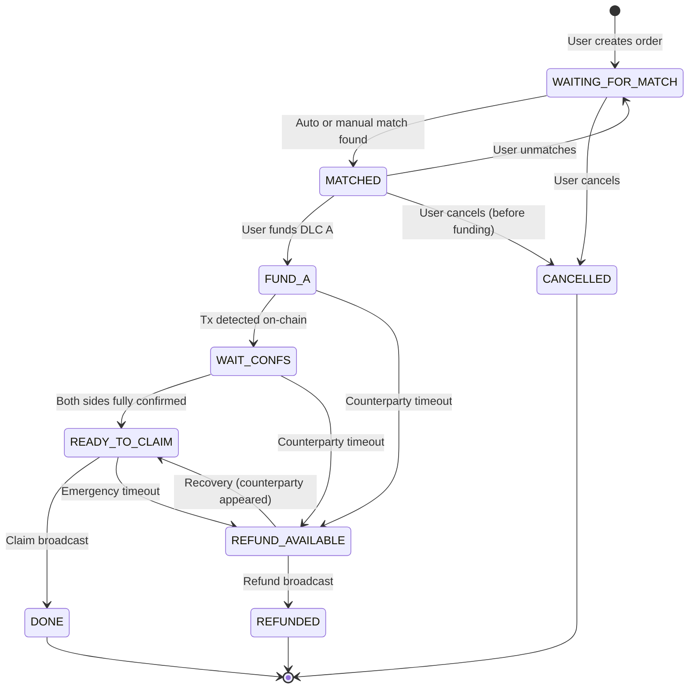
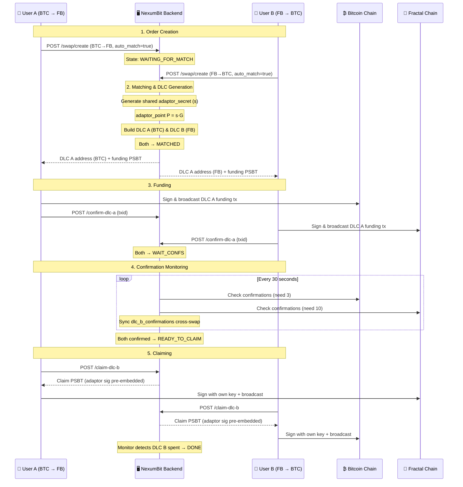
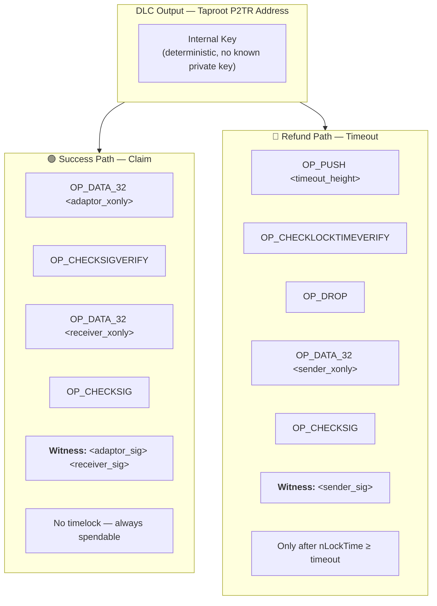
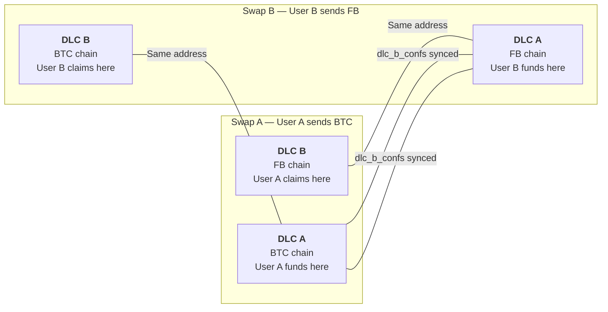

<p align="center">
  
</p>

<h1 align="center">NexumBit Protocol</h1>
<p align="center">
  <strong>Taproot-native cross-chain atomic swaps</strong><br>
  <strong>Bitcoin ↔ Fractal Bitcoin</strong> (primary pair in this specification)<br>
  Discreet Log Contracts (DLCs) with adaptor signatures on P2TR
</p>

<table align="center" border="0" cellspacing="0" cellpadding="0">
  <tr>
    <td align="center" width="120">
      <br>
      <strong>Bitcoin</strong>
    </td>
    <td align="center" width="80">
      <code>&nbsp;⟶&nbsp;</code><br>
      <code>&nbsp;⟵&nbsp;</code>
    </td>
    <td align="center" width="120">
      <br>
      <strong>Fractal Bitcoin</strong>
    </td>
  </tr>
</table>

<p align="center">
  <code>Non-Custodial</code> · <code>Atomic</code> · <code>On-Chain Verified</code> · <code>Open Protocol</code>
</p>

<p align="center">
  <sub><strong>Scope &amp; trust model:</strong> This document specifies the <strong>atomic swap</strong> leg. Swaps here are <strong>non-custodial</strong> (funds sit in on-chain Taproot outputs; the backend matches and builds PSBTs, it does not custody keys or balances) and <strong>atomic</strong> at the DLC layer. You still rely on the coordinator for correct matching and PSBT construction—replaceable, but not “zero trust.” <strong>Cross-chain lending</strong> is described in other docs: collateral and loan flows are also non-custodial at the UTXO level, but settlement can involve <strong>oracles, timelocks, or attestation modes</strong>—so the same “trustless” label does not apply uniformly; see the lending intro.</sub>
</p>

---

## NexumBit

### Why

Bitcoin and Fractal Bitcoin share the same architecture, the same scripting language, and the same UTXO model — yet moving value between them today requires trusting a centralized bridge with your funds. Wrapped tokens introduce counterparty risk. Centralized exchanges add KYC friction, withdrawal delays, and custodial exposure. Users deserve a way to swap BTC ↔ FB that is as trustless as Bitcoin itself.

NexumBit exists because **cross-chain swaps should not require trust**.

### What

NexumBit is a **non-custodial, peer-to-peer atomic swap protocol** purpose-built for Bitcoin and Fractal Bitcoin. It replaces traditional HTLC-based bridges with **Discreet Log Contracts (DLCs)** on **Taproot**, using **adaptor signatures** to cryptographically bind two independent on-chain transactions into a single atomic operation.

- **No wrapped tokens.** You send real BTC; you receive real FB (and vice versa).
- **No custodian.** Funds are locked in on-chain Taproot contracts that only the rightful owner can spend.
- **Script-enforced rules.** Who can claim, when refunds unlock, and how paths behave are defined by Tapscript on each chain (the backend does not override on-chain semantics).
- **No revealed secrets.** Unlike HTLC preimages, adaptor secrets never appear on-chain, preserving privacy.

The backend serves as a **matchmaker and PSBT builder** — it pairs compatible orders, constructs the contracts, and pre-signs its part of the adaptor signatures. It never holds keys, never custodies funds, and can be replaced without affecting locked contracts.

### How

1. **Two users create opposite orders** — one wants to send BTC and receive FB; the other wants to send FB and receive BTC.
2. **The backend matches them**, generates a shared adaptor secret, and builds Taproot DLC addresses on both chains — each with a claim path (requiring the adaptor secret + receiver's key) and a refund path (requiring only the sender's key after a timelock).
3. **Both users fund their respective DLCs** — User A sends BTC to DLC A; User B sends FB to DLC B. The backend monitors confirmations on both chains.
4. **Once both are confirmed, claims become available.** When either user claims, the adaptor secret is revealed to the counterparty through the pre-signed adaptor signature, enabling both sides to claim. This is the atomicity guarantee.
5. **If anything goes wrong**, timelocks ensure each user can reclaim their own funds after expiry — no counterparty cooperation needed.

The entire flow is coordinated through PSBTs (Partially Signed Bitcoin Transactions) that the user signs in their own wallet. The backend constructs them; the user approves them. Sovereignty is never surrendered.

---

## See also

Everything from [Overview](#overview) onward is the **Bitcoin ↔ Fractal Bitcoin atomic swap** path: Taproot DLCs, adaptor binding, matching, timelocks, and recovery. For **cross-chain lending** (collateral + loan legs, lifecycle) and **offline PSBT signing**, use the companion material instead of expecting it here:

- [`docs/DLC_LENDING_INTRO.md`](docs/DLC_LENDING_INTRO.md) — lending overview  
- [`docs/DLC_LENDING_DEVELOPER_GUIDE.md`](docs/DLC_LENDING_DEVELOPER_GUIDE.md) — developer map  
- [`nexum-open-source/lending_dlc_builder/`](nexum-open-source/lending_dlc_builder/) and [`WITNESS.md`](nexum-open-source/lending_dlc_builder/WITNESS.md) — collateral builders  
- [`psbt-signer/README.md`](psbt-signer/README.md) — swap and lending PSBT signing  
- [`nexum-open-source/WHAT_WE_RELEASE.md`](nexum-open-source/WHAT_WE_RELEASE.md) — what is published as open source  

---

## Table of Contents

- [NexumBit](#nexumbit)
- [See also](#see-also)
- [Overview](#overview)
- [Architecture](#architecture)
  - [Batch Matching (1↔1, 1↔N, N↔1, N↔M)](#batch-matching-11-1n-n1-nm)
- [Protocol Flow](#protocol-flow)
  - [State Machine](#state-machine)
  - [Happy Path — Step by Step](#happy-path--step-by-step)
  - [Sequence Diagram](#sequence-diagram)
- [On-Chain Construction](#on-chain-construction)
  - [Taproot Script Tree](#taproot-script-tree)
  - [Success Script (Claim Path)](#success-script-claim-path)
  - [Refund Script (Timeout Path)](#refund-script-timeout-path)
  - [DLC Address Derivation](#dlc-address-derivation)
  - [PSBT Construction](#psbt-construction)
- [Adaptor Signatures & Atomicity](#adaptor-signatures--atomicity)
  - [How Adaptor Secrets Work](#how-adaptor-secrets-work)
  - [Why This Is Atomic](#why-this-is-atomic)
  - [Pre-Signed Adaptor Signatures](#pre-signed-adaptor-signatures)
- [Timelock Security Model](#timelock-security-model)
  - [Why DLC A Expires Before DLC B](#why-dlc-a-expires-before-dlc-b)
  - [Attack Prevention](#attack-prevention)
  - [Confirmation Gates](#confirmation-gates)
- [Cross-Swap Data Linking](#cross-swap-data-linking)
- [Failure Scenarios & Recovery](#failure-scenarios--recovery)
- [Worked Example](#worked-example)
- [API Reference](#api-reference)
- [Configuration Parameters](#configuration-parameters)
- [BIP Compliance](#bip-compliance)
- [License](#license)

---

## Overview

NexumBit is a **fully non-custodial, peer-to-peer bridge** between **Bitcoin (BTC)** and **Fractal Bitcoin (FB)** — two architecturally identical but independent blockchains.

The protocol uses **Discreet Log Contracts (DLCs)** built on **Taproot (P2TR)** outputs with **adaptor signatures** to achieve atomic cross-chain swaps. At no point does any third party hold user funds. The NexumBit backend acts solely as a **matchmaker and PSBT builder** — all value transfer happens on-chain, verified by Bitcoin Script.

### Key Properties

| Property | Mechanism |
|---|---|
| **Non-custodial** | Funds locked in on-chain Taproot contracts; backend never holds keys |
| **Atomic** | Shared adaptor secret ensures both claims succeed or neither does |
| **Trustless** | Bitcoin Script enforces all conditions; backend is replaceable |
| **Private** | Adaptor secrets are never revealed on-chain (unlike HTLC preimages) |
| **Recoverable** | Timelock refund paths guarantee fund recovery without counterparty |

---

## Architecture

```
┌──────────────────┐                    ┌──────────────────┐
│    User A         │                    │    User B         │
│  (sends BTC)      │                    │  (sends FB)       │
│  UniSat Wallet    │                    │  UniSat Wallet    │
└────────┬─────────┘                    └────────┬─────────┘
         │                                        │
         │  HTTPS/JSON                            │  HTTPS/JSON
         ▼                                        ▼
┌─────────────────────────────────────────────────────────────┐
│                    NexumBit Backend                          │
│                                                             │
│  ┌─────────────┐  ┌──────────────┐  ┌────────────────────┐ │
│  │  Matching    │  │ DLC Builder  │  │   PSBT Builder     │ │
│  │  Service     │  │              │  │                    │ │
│  │  ──────────  │  │  ──────────  │  │  ──────────────    │ │
│  │  Pairs       │  │  Generates   │  │  Builds funding,   │ │
│  │  compatible  │  │  adaptor     │  │  claim, and refund │ │
│  │  orders by   │  │  secrets &   │  │  PSBTs with pre-   │ │
│  │  rate and    │  │  Taproot     │  │  embedded adaptor  │ │
│  │  amount      │  │  scripts     │  │  signatures        │ │
│  └─────────────┘  └──────────────┘  └────────────────────┘ │
│                                                             │
│  ┌─────────────┐  ┌──────────────┐  ┌────────────────────┐ │
│  │  Swap        │  │ Script       │  │   Taproot          │ │
│  │  Monitor     │  │ Builder      │  │   Helpers          │ │
│  │  ──────────  │  │  ──────────  │  │  ──────────────    │ │
│  │  Watches     │  │  success &   │  │  Leaf hashes,      │ │
│  │  mempool +   │  │  refund      │  │  merkle trees,     │ │
│  │  confirms    │  │  Tapscripts  │  │  tweaked keys,     │ │
│  │  for both    │  │  (BIP-342)   │  │  control blocks    │ │
│  │  chains      │  │              │  │  (BIP-341)         │ │
│  └─────────────┘  └──────────────┘  └────────────────────┘ │
└─────────────────────────────────────────────────────────────┘
         │                                        │
         ▼                                        ▼
┌──────────────────┐                    ┌──────────────────┐
│  Bitcoin Network  │                    │ Fractal Bitcoin   │
│  (BTC)            │                    │ (FB)              │
│  3 conf required  │                    │ 10 conf required  │
└──────────────────┘                    └──────────────────┘
```

### Batch Matching (1↔1, 1↔N, N↔1, N↔M)

NexumBit supports batch matching to increase throughput and liquidity efficiency:

- **1↔1**: One initiator matches one counter (standard flow).
- **1↔N**: One initiator matches multiple counters; initiator's amount is split across N counterparties.
- **N↔1**: Multiple initiators match one counter; counter's amount is split across N initiators.
- **N↔M**: Multiple initiators match multiple counters in a bipartite allocation.

**Shared adaptor secret**: All pairs in a batch share one adaptor secret. When any party claims, the adaptor is revealed on-chain; other batch members can then claim. Atomicity is preserved across the entire batch.

**Funding policy**: Each swap in a batch has its own DLC A and DLC B. All pairs must be funded before any can transition to READY_TO_CLAIM. Unmatch is only allowed when **no** DLC A in the batch has been funded.

**Refund policy**: Per-swap, per-DLC A. Each user refunds their own DLC A after timelock expiry; no batch coordination. Refund path is independent (OP_CHECKLOCKTIMEVERIFY + sender sig).

**Rate/slippage**: Batch matching uses configurable `BATCH_SLIPPAGE_BPS` (default 1%). Static-rate orders must agree within `MATCH_RATE_STATIC_TOLERANCE_BPS` (5%). Dynamic orders accept market rate.

---

## Protocol Flow

### State Machine

Every swap progresses through a deterministic state machine. Invalid transitions are rejected by the `SwapStateMachine` validator.



### Happy Path — Step by Step

1. **User A** posts an order: "I want to swap 0.00001010 BTC for ~1.535 FB"
2. **User B** posts an order: "I want to swap 1.535 FB for ~0.00001010 BTC"
3. **Matching Service** finds them compatible (amounts and rates within configured tolerance)
4. **Backend generates** a single shared adaptor secret `s` and public point `P = s·G`
5. **Backend builds** two DLC contracts:
   - **DLC A** on BTC: User A locks BTC; User B can claim with adaptor sig + their key
   - **DLC B** on FB: User B locks FB; User A can claim with adaptor sig + their key
6. Both users **fund their DLC A** (sign and broadcast funding transactions)
7. **Swap Monitor** watches both chains for confirmations (3 for BTC, 10 for FB)
8. Once **both sides are confirmed**, state transitions to `READY_TO_CLAIM`
9. **User A claims** DLC B (FB) using a pre-signed adaptor signature + their own key
10. **User B claims** DLC A (BTC) using a pre-signed adaptor signature + their own key
11. Both swaps marked `DONE`

### Sequence Diagram



---

## On-Chain Construction

### Taproot Script Tree

Each DLC output is a **Taproot (P2TR)** address containing two spending paths in a script tree:



### Success Script (Claim Path)

The claim script requires **two signatures**: one from the adaptor point (pre-signed by the backend using the shared secret) and one from the receiver's key.

```
<adaptor_xonly_pubkey> OP_CHECKSIGVERIFY
<receiver_xonly_pubkey> OP_CHECKSIG
```

**Witness stack** (bottom to top):
```
<receiver_schnorr_signature>
<adaptor_schnorr_signature>
<success_script>
<control_block>
```

The adaptor signature is constructed server-side from the shared adaptor secret, then embedded into the claim PSBT. The user only needs to add their own Schnorr signature.

### Refund Script (Timeout Path)

The refund script allows the original sender to reclaim funds after a block height timeout:

```
<timeout_block_height> OP_CHECKLOCKTIMEVERIFY OP_DROP
<sender_xonly_pubkey> OP_CHECKSIG
```

**Witness stack**:
```
<sender_schnorr_signature>
<refund_script>
<control_block>
```

Transaction must set `nLockTime >= timeout_block_height`.

**Refund grace period (security)**: The timeout used in the refund script is **nominal timeout + REFUND_GRACE_HOURS** (e.g. 24h in blocks). So the sender can only refund after that later block. Until then, only the **receiver** can spend (claim path, no time limit). This prevents "claim then refund" theft: if User A claims DLC B (getting User B's funds) and the adaptor is revealed on-chain, User B has the grace window to still claim DLC A. If the refund path used the nominal timeout only, User A could refund DLC A immediately after claiming and keep both sides.

### DLC Address Derivation

The DLC address is derived following **BIP-341** Taproot output construction:

```
1. Build leaf scripts:
   success_script = CHECKSIGVERIFY(adaptor) + CHECKSIG(receiver)
   refund_script  = CLTV(timeout) + CHECKSIG(sender)

2. Compute leaf hashes (BIP-341 TapLeaf):
   leaf_hash = TaggedHash("TapLeaf", 0xC0 || compact_size(script) || script)

3. Build merkle tree:
   merkle_root = TaggedHash("TapBranch", sort(success_hash, refund_hash))

4. Derive internal key:
   internal_key = deterministic_from(adaptor_point, receiver, sender, timeout)

5. Tweak to output key:
   tweak = TaggedHash("TapTweak", internal_key || merkle_root)
   output_key = internal_key + tweak·G

6. Encode as bech32m address:
   address = bech32m_encode("bc", 1, output_key)
```

> **Critical**: Leaf version MUST be `0xC0` (Tapscript). Using `0x00` creates unspendable outputs per BIP-342.

### PSBT Construction

All transactions are built as **PSBTs (BIP-174 / BIP-370)** and signed client-side via the UniSat wallet:

| Transaction | Built By | Signed By | Contains |
|---|---|---|---|
| **Funding** | Backend | User (UniSat) | Sends exact amount to DLC P2TR address |
| **Claim** | Backend | User (UniSat) | Spends DLC via success path; adaptor sig pre-embedded |
| **Refund** | Backend | User (UniSat) | Spends DLC via refund path after timeout; nLockTime set |

Claim PSBTs include the adaptor signature in `taproot_sigs` (BIP-371), so the user only signs with their own key.

---

## Adaptor Signatures & Atomicity

### How Adaptor Secrets Work

Unlike HTLCs (which reveal a preimage on-chain via `OP_HASH160`), DLCs use **adaptor signatures** — a cryptographic construction where knowledge of a secret scalar allows completing an otherwise-incomplete Schnorr signature.

```
1. Backend generates random scalar:   s  (adaptor secret)
2. Derives public point:              P = s · G  (adaptor point)
3. Both DLC scripts include P as the adaptor_pubkey
4. Backend creates Schnorr signature using s for each claim PSBT
5. User adds their own signature to complete the witness
```

The adaptor secret `s` is the **atomic link** between both DLCs. Both claim transactions require a valid signature under the adaptor point `P`, and only someone who knows `s` can produce that signature.

### Why This Is Atomic

```
DLC A (BTC chain):  claim requires sig_from(adaptor_secret) + sig_from(User B key)
DLC B (FB chain):   claim requires sig_from(adaptor_secret) + sig_from(User A key)
```

Both DLCs use the **same adaptor point** `P`. The backend holds `s` and pre-signs both adaptor signatures. Since both users receive their claim PSBTs with adaptor sigs already embedded, both can claim. If one claims, the other can always claim too (the adaptor sig is already in their PSBT).

If neither claims, both can refund after their respective timelocks expire.

### Pre-Signed Adaptor Signatures

The adaptor signature is **pre-embedded** into the claim PSBT by the backend using standard BIP-371 Taproot PSBT fields. This means:

- The **adaptor secret is never transmitted** to users over the network
- Users only see the **adaptor point** (public, safe to share)
- The backend constructs the adaptor signature and embeds it into the PSBT
- Users sign only with their own private key via their wallet

---

## Timelock Security Model

### Why DLC A Expires Before DLC B

```
Timeline:

Block 0          Block T_A              Block T_B
  │                 │                      │
  ▼                 ▼                      ▼
  ├─── DLC A valid ─┤                      │
  │   (claim ok)    │ refund available     │
  │                 │                      │
  ├──────────── DLC B valid ───────────────┤
  │              (claim ok)                │ refund available
```

- **DLC A timeout** (shorter): allows the first funder to reclaim sooner if counterparty disappears
- **DLC B timeout** (longer): gives the second funder adequate time to fund and claim

This ordering is critical:

1. User A funds DLC A first (the one with the shorter timeout)
2. User B sees DLC A funded, then funds DLC B
3. Both claim during the window when both DLCs are active
4. If User B never funds, User A can refund DLC A after `T_A`
5. If User A claims DLC B but somehow User B can't claim DLC A, User B refunds DLC B after `T_B`

### Attack Prevention

| Attack | Prevention |
|---|---|
| **Double-spend (RBF)** | Claims only allowed after full confirmations (3 BTC / 10 FB) |
| **Counterparty disappears** | Timelock refund path guarantees fund recovery |
| **One-sided claim** | Shared adaptor secret means if one can claim, both can |
| **Reorg attack** | Confirmation gates prevent premature claiming |
| **Backend compromise** | Backend never holds user keys; worst case = DoS, not theft |

### Confirmation Gates

Both sides must reach their required confirmation targets before **either** side can claim:

```
              ┌───────────────────────────┐
              │  BOTH chains confirmed?   │
              │  BTC ≥ target AND         │
              │  FB  ≥ target             │
              └────────────┬──────────────┘
                           │ YES
                           ▼
              ┌───────────────────────────┐
              │  READY_TO_CLAIM           │
              │  Both users can claim     │
              └───────────────────────────┘
```

This prevents a scenario where User A claims on a fast-confirming chain while their own funding transaction gets reorganized.

---

## Cross-Swap Data Linking

When two swaps are matched, their DLC contracts are **cross-referenced**:



- **Swap A's DLC B** = **Swap B's DLC A** (same on-chain address on FB)
- **Swap B's DLC B** = **Swap A's DLC A** (same on-chain address on BTC)
- Both DLCs share the **same adaptor point** (derived from the same secret)
- Confirmation counts are synced bidirectionally

---

## Failure Scenarios & Recovery


### Recovery Kit

For eligible swap states, users can download a **Recovery Kit** containing all data needed to independently complete or exit the swap without the NexumBit backend. This ensures full self-sovereignty — even if the backend goes offline permanently, users can always recover their funds using standard Bitcoin tooling.

---

## Worked Example

A simplified walkthrough of a completed BTC ↔ FB swap:

### Setup

| | User A | User B |
|---|---|---|
| **Direction** | BTC → FB | FB → BTC |
| **Sends** | X sats on BTC | Y sats on FB |
| **Receives** | Y sats on FB | X sats on BTC |

### DLC Contracts Generated

**Shared adaptor point**: `P` (same for both DLCs, derived from a single random secret `s`)

**DLC A (BTC chain)** — User A locks X sats:
```
Address:  bc1p<taproot_address_A>
Timeout:  Block H_a  (current_btc_height + timeout_delta)

Success script:  <P_xonly> CHECKSIGVERIFY <userB_xonly> CHECKSIG
Refund script:   H_a CLTV DROP <userA_xonly> CHECKSIG
```

**DLC B (FB chain)** — User B locks Y sats:
```
Address:  bc1p<taproot_address_B>
Timeout:  Block H_b  (current_fb_height + timeout_delta, where H_b > H_a in real time)

Success script:  <P_xonly> CHECKSIGVERIFY <userA_xonly> CHECKSIG
Refund script:   H_b CLTV DROP <userB_xonly> CHECKSIG
```

### Transaction Flow

```
1. User A funds DLC A on BTC chain → bc1p<address_A>

2. User B funds DLC B on FB chain  → bc1p<address_B>

3. Monitor confirms both chains reach required confirmations ✓

4. User A claims DLC B on FB:
   Witness: <adaptor_sig> <userA_sig> <success_script> <control_block>

5. User B claims DLC A on BTC:
   Witness: <adaptor_sig> <userB_sig> <success_script> <control_block>

6. Both swaps → DONE ✓
```

---

## API Reference

### Core Endpoints

| Method | Path | Description |
|---|---|---|
| `POST` | `/v1/swap/create` | Create a new swap order |
| `POST` | `/v1/swap/{id}/confirm-dlc-a` | Confirm DLC A funding with txid |
| `POST` | `/v1/swap/{id}/claim-dlc-b` | Get pre-signed claim PSBT |
| `POST` | `/v1/swap/{id}/refund-dlc-a` | Get refund PSBT (after timeout) |
| `POST` | `/v1/swap/{id}/cancel` | Cancel unfunded order |
| `POST` | `/v1/swap/{id}/unmatch` | Unmatch from counterparty |
| `GET`  | `/v1/swap/{id}` | Get swap details |
| `GET`  | `/v1/swap/user/{address}` | Get all swaps for an address |
| `GET`  | `/v1/swap/active-orders` | List available orders |
| `GET`  | `/v1/swap/{id}/recovery-kit` | Download recovery data |

### Supporting Endpoints

| Method | Path | Description |
|---|---|---|
| `GET` | `/v1/rate/fb-btc` | Current exchange rate |
| `GET` | `/v1/stats/bridge` | Bridge statistics |
| `POST` | `/v1/quote` | Get a swap quote |

### Create Swap Request

```json
{
  "quote_id": "abc123...",
  "user_refund_xonly": "619b7600...",
  "user_pubkey_to": "02619b76...",
  "adaptor_secret": "23839a2a...",
  "matching_enabled": true,
  "matching_slippage_bps": 500
}
```

### Claim Response

```json
{
  "psbt_hex": "70736274ff...",
  "message": "Sign this PSBT with your wallet to claim funds"
}
```

The PSBT contains the adaptor signature pre-embedded in `taproot_sigs`. The user only needs to add their own Schnorr signature.

---

## Configuration Parameters

| Parameter | Description |
|---|---|
| `CONF_BTC` | Required Bitcoin confirmations before claim is allowed |
| `CONF_FB` | Required Fractal Bitcoin confirmations before claim is allowed |
| `TIMEOUT_A` | DLC A refund timeout — shorter, protects the first funder |
| `TIMEOUT_B` | DLC B refund timeout — longer, gives second funder more time |
| `INTENT_TTL` | How long an unmatched order stays active before expiring |
| `SLIPPAGE_BPS` | Configurable per-order slippage tolerance for auto-matching |

> Exact values are configurable at deployment and not disclosed here.

---

## BIP Compliance

| BIP | Usage |
|---|---|
| **BIP-174** | PSBT v0 format for all transaction construction |
| **BIP-341** | Taproot output construction, merkle trees, tweaked keys |
| **BIP-342** | Tapscript execution (leaf version `0xC0`) |
| **BIP-340** | Schnorr signatures for all script-path spending |
| **BIP-322** | Message signing for wallet ownership verification |
| **BIP-371** | Taproot PSBT fields (`taproot_sigs`, `tap_leaf_script`) |

---

## License

This protocol specification and the NexumBit implementation are released as **open source**. The cryptographic constructions, script templates, and swap flow described herein are available for anyone to implement, audit, or build upon.

The protocol is based on well-established Bitcoin primitives (Taproot, Schnorr signatures, CLTV timelocks) and does not rely on any proprietary or patented technology.

---

<p align="center">
  <sub>Built with Taproot & Adaptor Signatures · Powered by Bitcoin Script</sub>
</p>
