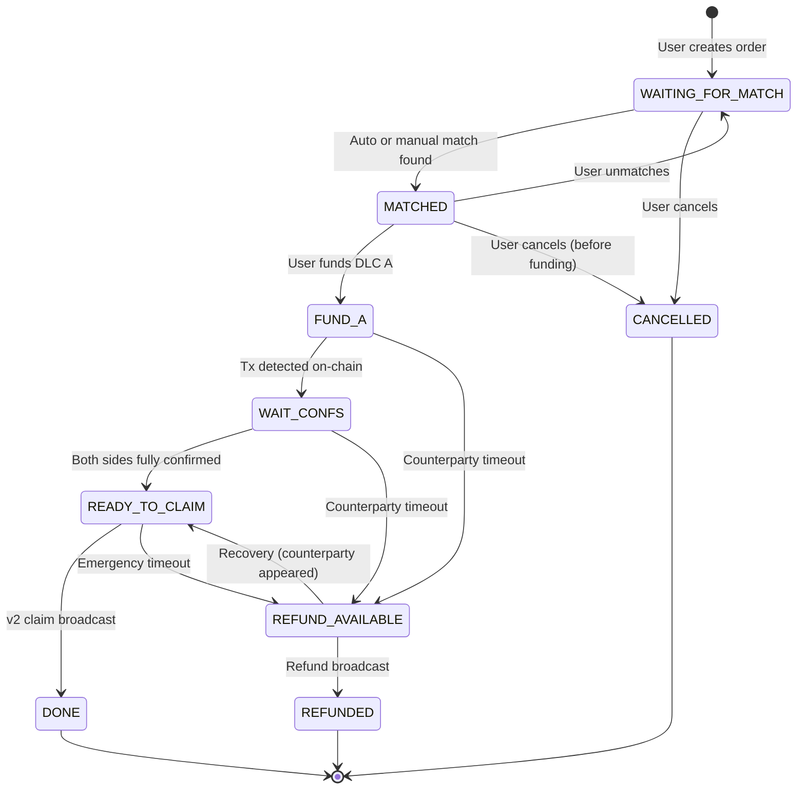
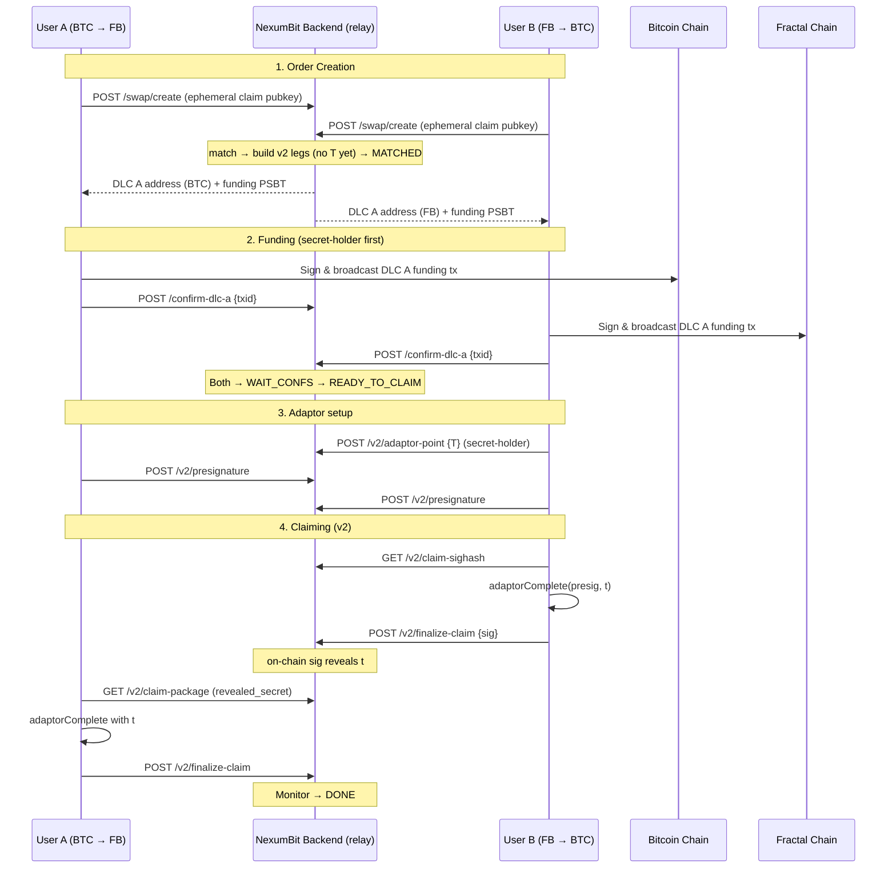
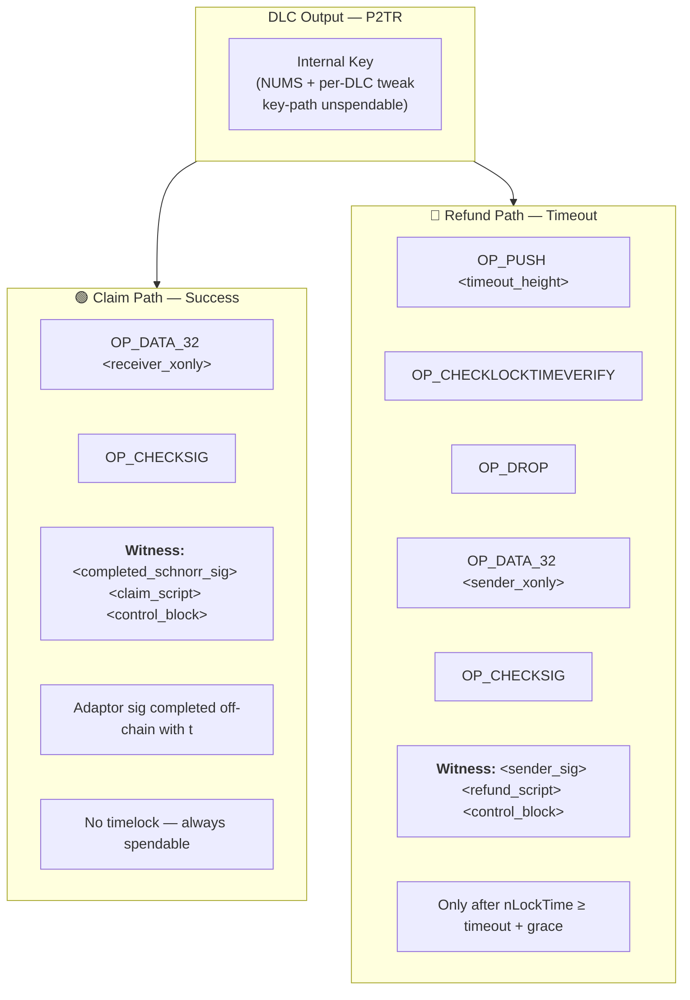
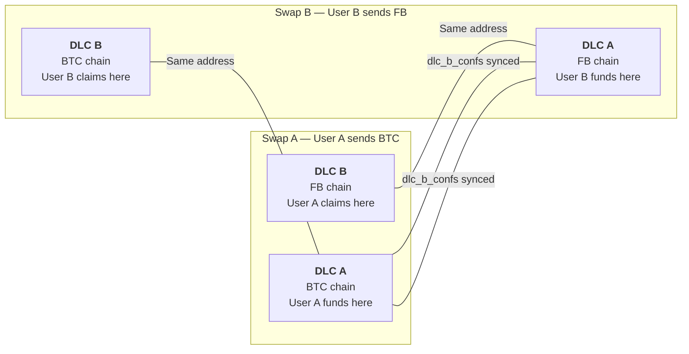
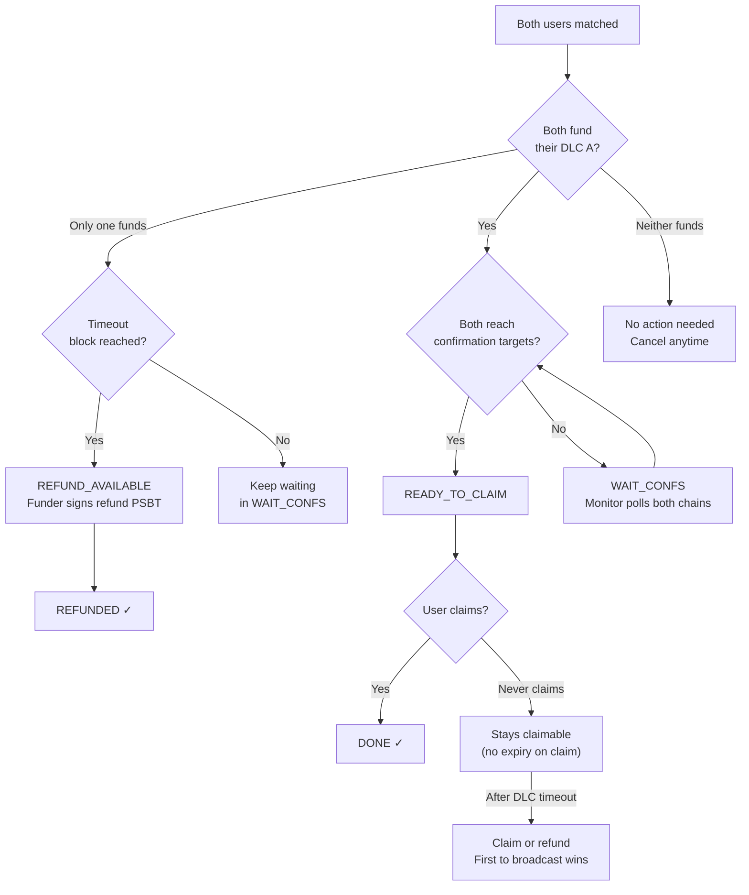

<p align="center">
  
</p>

<h1 align="center">NexumBit Protocol</h1>
<p align="center">
  <strong>Taproot-native cross-chain atomic swaps &amp; lending</strong><br>
  <strong>Protocol v1 -> v2</strong> — genuine BIP-340 adaptor signatures on P2TR<br>
  <strong>Bitcoin ↔ Fractal Bitcoin</strong> (primary swap pair in this specification)
</p>

<table align="center" border="0" cellspacing="0" cellpadding="8">
  <tr>
    <td align="center" width="100">
      <br>
      <strong>Bitcoin</strong><br><small>BTC</small>
    </td>
    <td align="center" width="100">
      <br>
      <strong>Fractal Bitcoin</strong><br><small>FB</small>
    </td>
    <td align="center" width="100">
      <br>
      <strong>Litecoin</strong><br><small>LTC</small>
    </td>
    <td align="center" width="100">
      <br>
      <strong>DigiByte</strong><br><small>DGB</small>
    </td>
    <td align="center" width="100">
      <br>
      <strong>Groestlcoin</strong><br><small>GRS</small>
    </td>
    <td align="center" width="100">
      <br>
      <strong>Bellscoin</strong><br><small>BEL</small>
    </td>
  </tr>
</table>

<p align="center">
  <code>Non-Custodial</code> · <code>Atomic</code> · <code>On-Chain Verified</code> · <code>Open Protocol</code>
</p>

<p align="center">
  <sub><strong>Trust model (v2):</strong> Funds sit in on-chain Taproot script paths only. The coordinator <strong>never holds adaptor secrets or claim keys</strong> for swaps — it matches orders, builds descriptors, and <strong>relays public pre-signatures</strong>. Atomicity is <strong>cryptographically enforced</strong>: completing a claim on-chain reveals the adaptor secret <code>t</code> to the counterparty via BIP-340 signature extraction. <strong>Lending</strong> uses the same v2 primitives; some loan paths are <strong>server-gated</strong> (collateral release after verified repayment) — see <a href="#lending-v2">Lending v2</a>.</sub>
</p>

---

## Repository layout

| Package | Purpose |
|---------|---------|
| [`dlc_v2_builder/`](dlc_v2_builder/README.md) | **Protocol v2** swap DLCs + BIP-340 adaptor math (use this for new work) |
| [`dlc_builder/`](dlc_builder/README.md) | Deprecated v1 swap scripts + shared Taproot helpers |
| [`lending_dlc_builder/`](lending_dlc_builder/README.md) | 3-leaf collateral DLC for cross-chain lending |
| [`Signer/`](Signer/README.md) | Offline recovery &amp; PSBT signing (`signer.py`) |
| [`PROTOCOL.md`](PROTOCOL.md) | Full protocol specification (v2, API detail) |

```bash
pip install -r dlc_v2_builder/requirements.txt -r dlc_builder/requirements.txt
export PYTHONPATH=.
python3 dlc_v2_builder/test_roundtrip.py
python3 dlc_v2_builder/example_swap.py
```

---

### Why

Bitcoin, Fractal Bitcoin, and compatible forks share the same architecture, scripting language, and UTXO model — yet moving value between them today often requires trusting a centralized bridge. Wrapped tokens introduce counterparty risk. Centralized exchanges add KYC friction, withdrawal delays, and custodial exposure.

NexumBit exists because **cross-chain swaps should not require trust**.

### What (Protocol v2)

NexumBit is a **non-custodial, peer-to-peer atomic swap protocol** purpose-built for Bitcoin and Fractal Bitcoin. It replaces traditional HTLC-based bridges with **Discreet Log Contracts (DLCs)** on **Taproot**, using **real BIP-340 adaptor signatures** to cryptographically bind two independent on-chain transactions into a single atomic operation.

- **No wrapped tokens.** You send real BTC; you receive real FB (and vice versa).
- **No custodian.** Funds are locked in on-chain Taproot contracts spendable only via published script paths.
- **Script-enforced rules.** Who can claim, when refunds unlock, and how paths behave are defined by Tapscript on each chain.
- **Cryptographic atomicity.** The adaptor secret `t` is revealed on-chain when the first party claims; the counterparty extracts it from the completed Schnorr signature.
- **No coordinator claim key.** Deprecated v1 used `<point> CHECKSIGVERIFY <receiver> CHECKSIG` with a coordinator-held key — removed for new swaps.

The backend is a **matchmaker and relay** — it never holds `t` or ephemeral claim keys for swaps.

### How (v2 happy path)

1. **Two users create opposite orders** — each submits a **per-swap ephemeral claim key** (browser-held; wallets cannot adaptor-sign).
2. **The backend matches them** and builds **v2 DLC legs** (claim + refund scripts, **unspendable NUMS internal key**). Addresses do **not** depend on adaptor point `T`.
3. **Both users fund their DLC outputs** — secret-holder funds first in production. The backend monitors confirmations on both chains.
4. **Secret-holder** generates `t`, publishes `T = t·G` to the relay. Both parties submit **claim pre-signatures** (public, verified by the relay).
5. **Once both are confirmed, claims become available.** Either party **completes** their pre-signature with `t` → standard BIP-340 Schnorr on-chain → counterparty **extracts** `t` and claims the other leg.
6. **If anything goes wrong**, timelocks ensure each funder can reclaim via the CLTV refund path after timeout + grace — no counterparty cooperation needed.

Funding uses PSBTs signed in the user's wallet. Claim signing uses the ephemeral key in the browser signer or offline [`Signer/`](Signer/README.md). Sovereignty is never surrendered.

### Three key types (swaps)

| Key | Who holds it | Purpose |
|-----|--------------|---------|
| **Wallet key** | Your hardware / browser wallet | Fund DLC, sign **refund** after timeout |
| **Ephemeral claim key** | Browser signer or Recovery Kit | Sign **claim** path (`receiver_ephemeral_privkey`) |
| **Adaptor secret `t`** | Secret-holder until claim | Complete adaptor presignature; revealed on-chain after first claim |

NexumBit **never** stores wallet private keys or ephemeral claim keys on the server.

---

## See also

- **[Lending](lending_dlc_builder/README.md)** — 3-leaf collateral DLC, attestation modes, witness stacks ([`WITNESS.md`](lending_dlc_builder/WITNESS.md))
- **[Offline signer](Signer/README.md)** — recovery kit, v2 adaptor complete/extract, lending PSBT signing
- **[Full spec](PROTOCOL.md)** — API reference, lending v2, configuration

---

## Table of Contents

- [Repository layout](#repository-layout)
- [See also](#see-also)
- [Overview](#overview)
- [Architecture](#architecture)
- [Protocol Flow](#protocol-flow)
  - [State Machine](#state-machine)
  - [Happy Path — Step by Step](#happy-path--step-by-step)
  - [Sequence Diagram](#sequence-diagram)
  - [Role assignment](#role-assignment)
- [On-Chain Construction (v2)](#on-chain-construction-v2)
  - [Taproot Script Tree](#taproot-script-tree)
  - [Claim Script (Success Path)](#claim-script-success-path)
  - [Refund Script (Timeout Path)](#refund-script-timeout-path)
  - [DLC Address Derivation](#dlc-address-derivation)
  - [PSBT Construction](#psbt-construction)
- [Adaptor Signatures & Atomicity (v2)](#adaptor-signatures--atomicity-v2)
  - [BIP-340 Construction](#bip-340-construction)
  - [Why This Is Atomic](#why-this-is-atomic)
  - [What the Coordinator Stores](#what-the-coordinator-stores)
- [Timelock Security Model](#timelock-security-model)
  - [Funding order & timeouts](#funding-order--timeouts)
  - [Attack Prevention](#attack-prevention)
  - [Confirmation Gates](#confirmation-gates)
- [Cross-Swap Data Linking](#cross-swap-data-linking)
- [Failure Scenarios & Recovery](#failure-scenarios--recovery)
- [Worked Example](#worked-example)
- [Lending v2](#lending-v2)
- [API Reference](#api-reference)
- [Configuration Parameters](#configuration-parameters)
- [BIP Compliance](#bip-compliance)
- [Deprecated v1](#deprecated-v1)
- [License](#license)

---

## Overview

NexumBit is a **fully non-custodial, peer-to-peer bridge** supporting **Bitcoin (BTC)**, **Fractal Bitcoin (FB)**, **Litecoin (LTC)**, **DigiByte (DGB)**, **Groestlcoin (GRS)**, and **Bellscoin (BEL)** — Taproot-capable chains with a shared script model.

The protocol uses **Discreet Log Contracts (DLCs)** built on **Taproot (P2TR)** outputs with **genuine BIP-340 adaptor signatures** to achieve atomic cross-chain swaps. At no point does any third party custody user funds. The NexumBit backend acts as a **matchmaker and relay** — all value transfer happens on-chain, verified by Bitcoin Script.

### Key Properties

| Property | Mechanism |
|---|---|
| **Non-custodial** | Funds locked in on-chain Taproot script paths; coordinator never holds claim keys or `t` |
| **Atomic** | BIP-340 adaptor presign / complete / extract links both legs cryptographically |
| **Trust-minimized** | Script enforces spend rules; coordinator is replaceable (worst case: DoS / bad relay data) |
| **On-chain revelation** | First claim broadcasts completed Schnorr `s`; counterparty extracts `t = s − s' (mod n)` |
| **Recoverable** | Timelock refund paths + offline [`Signer/`](Signer/README.md) recovery kit |

---

## Architecture

```
┌──────────────────┐                     ┌──────────────────┐
│    User A        │                     │    User B        │
│  wallet: fund    │                     │  wallet: fund    │
│  browser: claim  │                     │  browser: claim  │
│  (ephemeral key) │                     │  (ephemeral key) │
└────────┬─────────┘                     └────────┬─────────┘
         │                                        │
         │  HTTPS/JSON                            │  HTTPS/JSON
         ▼                                        ▼
┌─────────────────────────────────────────────────────────────┐
│                    NexumBit Backend (relay)                  │
│                                                             │
│  ┌─────────────┐   ┌──────────────┐  ┌────────────────────┐ │
│  │  Matching    │  │ v2 DLC       │  │   PSBT Builder     │ │
│  │  Service     │  │ Builder      │  │                    │ │
│  │  ──────────  │  │  ──────────  │  │  ──────────────    │ │
│  │  Pairs       │  │  NUMS        │  │  Funding + refund  │ │
│  │  compatible  │  │  internal    │  │  PSBTs; claim      │ │
│  │  orders      │  │  key, claim  │  │  sighash assembly  │ │
│  │              │  │  + refund    │  │                    │ │
│  └─────────────┘  └──────────────┘  └────────────────────┘  │
│                                                             │
│  ┌─────────────┐   ┌──────────────┐  ┌────────────────────┐ │
│  │  Swap        │  │ Adaptor Sig  │  │   Taproot          │ │
│  │  Monitor     │  │ Verifier     │  │   Helpers          │ │
│  │  ──────────  │  │  ──────────  │  │  ──────────────    │ │
│  │  Confirms +  │  │  Presign /   │  │  Leaf hashes,      │ │
│  │  extracts t  │  │  verify /    │  │  merkle trees,     │ │
│  │  from chain  │  │  relay only  │  │  control blocks    │ │
│  └─────────────┘  └──────────────┘  └────────────────────┘  │
│                                                             │
│  DOES NOT hold: t, ephemeral claim keys, coordinator cosign  │
└─────────────────────────────────────────────────────────────┘
         │                                        │
         ▼                                        ▼
┌──────────────────┐                    ┌──────────────────┐
│  Bitcoin Network │                    │ Fractal Bitcoin  │
│  (BTC)           │                    │ (FB)             │
│  + conf required │                    │  + conf required │
└──────────────────┘                    └──────────────────┘
```

| Open-source component | Role |
|---|---|
| [`dlc_v2_builder/`](dlc_v2_builder/README.md) | v2 descriptors, NUMS internal key, BIP-340 adaptor math |
| [`Signer/`](Signer/README.md) | Offline presign / complete / extract, recovery kit |
| [`lending_dlc_builder/`](lending_dlc_builder/README.md) | 3-leaf collateral DLC |

---

## Protocol Flow

### State Machine

Every swap progresses through a deterministic state machine. Invalid transitions are rejected by the `SwapStateMachine` validator.



### Happy Path — Step by Step

1. **User A** posts an order: "I want to swap 0.00001010 BTC for ~1.535 FB" (includes ephemeral claim pubkey)
2. **User B** posts an order: "I want to swap 1.535 FB for ~0.00001010 BTC" (includes ephemeral claim pubkey)
3. **Matching Service** finds them compatible (amounts and rates within configured tolerance)
4. **Backend builds** two v2 DLC legs (claim + refund, NUMS internal key). Adaptor point `T` is **not** required yet.
5. **Secret-holder funds first** (party with earlier refund deadline). Counterparty funds after holder's DLC A is visible on-chain.
6. **Swap Monitor** watches both chains for confirmations (e.g. 3 BTC / 10 FB)
7. Once **both sides are confirmed**, state transitions to `READY_TO_CLAIM`
8. **Secret-holder** generates `t`, publishes `T = t·G`. Both parties submit **claim pre-signatures** over the claim sighash.
9. **Secret-holder claims first** (or either party): `adaptorComplete(presig, t)` → broadcast standard Schnorr signature
10. **Counterparty extracts** `t` from on-chain signature, completes their pre-signature, claims their leg
11. Both swaps marked `DONE`

### Sequence Diagram



### Role assignment

- **Leg A** = User A's funded output (claimed by B's ephemeral key).
- **Leg B** = User B's funded output (claimed by A's ephemeral key).
- **First-claimed leg** = whichever has the **earlier** refund unlock (after grace).
- **Secret-holder** = receiver of the first-claimed leg → generates and holds `t` until claim.

---

## On-Chain Construction (v2)

### Taproot Script Tree

Each DLC output is a **Taproot (P2TR)** address containing two spending paths in a script tree. The **internal key is unspendable** (NUMS + per-DLC tweak) — funds can only move via script paths.



### Claim Script (Success Path)

The v2 claim script requires a **single** Schnorr signature under the ephemeral receiver key:

```
<receiver_xonly_pubkey> OP_CHECKSIG
```

**Witness stack** (bottom to top):

```
<completed_bip340_schnorr_signature>   # adaptorComplete(presig, t)
<claim_script>
<control_block>
```

Atomicity is **off-chain**: the completed signature is a standard BIP-340 Schnorr sig valid under the receiver pubkey. The adaptor point `T` is **not** in the script.

### Refund Script (Timeout Path)

The refund script allows the original sender (wallet key) to reclaim funds after a block height timeout:

```
<timeout_block_height> OP_CHECKLOCKTIMEVERIFY OP_DROP
<sender_xonly_pubkey> OP_CHECKSIG
```

**Witness stack**:

```
<sender_schnorr_signature>
<refund_script>
<control_block>
```

Transaction must set `nLockTime >= timeout_block_height` (+ grace period in production).

### DLC Address Derivation

The DLC address is derived following **BIP-341** Taproot output construction:

```
1. Build leaf scripts:
   claim_script  = CHECKSIG(receiver_ephemeral)
   refund_script = CLTV(timeout) + CHECKSIG(sender_wallet)

2. Compute leaf hashes (BIP-341 TapLeaf):
   leaf_hash = TaggedHash("TapLeaf", 0xC0 || compact_size(script) || script)

3. Build merkle tree:
   merkle_root = TaggedHash("TapBranch", sort(claim_hash, refund_hash))

4. Derive internal key (v2 — unspendable):
   r = TaggedHash("NexumDLCv2/internal", claim_hash || refund_hash)
   internal_key = NUMS_point + r·G   (no known discrete log)

5. Tweak to output key:
   tweak = TaggedHash("TapTweak", internal_key || merkle_root)
   output_key = internal_key + tweak·G

6. Encode as bech32m address:
   address = bech32m_encode(hrp, 1, output_key)
```

> **Critical**: Leaf version MUST be `0xC0` (Tapscript). Using `0x00` creates unspendable outputs per BIP-342.

> **Note**: Adaptor point `T` does **not** affect the address or scripts. It is published post-funding for presignature exchange only.

Build descriptors in Python: [`dlc_v2_builder`](dlc_v2_builder/README.md).

### PSBT Construction

| Transaction | Built By | Signed By | Contains |
|---|---|---|---|
| **Funding** | Backend | User wallet (UniSat, etc.) | Sends exact amount to DLC P2TR address |
| **Claim** | Backend (sighash) + client | Ephemeral claim key (browser / Signer) | Spends DLC via claim path; completed adaptor Schnorr in witness |
| **Refund** | Backend | User wallet | Spends DLC via refund path after timeout; `nLockTime` set |

Claim transactions require the client to **complete** an adaptor pre-signature with `t` before broadcast. The coordinator relays public pre-signatures but never holds `t`.

---

## Adaptor Signatures & Atomicity (v2)

### BIP-340 Construction

Unlike HTLCs (which reveal a preimage on-chain via `OP_HASH160`), v2 uses **real BIP-340 Schnorr adaptor signatures**:

```
Setup:   signer secret d, P = d·G (x-only, even-Y per BIP-340);
         adaptor secret t, T = t·G (33-byte compressed point)

Presign(d, msg, T) → (R', s')     R_adapted = R' + T must have even Y
Complete(presig, t) → (r, s)      standard Schnorr valid for P over msg
Extract(presig, sig, T) → t       t = (s − s') mod n
```

Implemented in [`dlc_v2_builder/adaptor_sig.py`](dlc_v2_builder/adaptor_sig.py), [`Signer/signer.py`](Signer/signer.py), and the NexumBit browser `adaptor-signer.js` (byte-compatible).

### Why This Is Atomic

```
DLC A (BTC):  claim = adaptorComplete(presig_A, t) under B's ephemeral key
DLC B (FB):   claim = adaptorComplete(presig_B, t) under A's ephemeral key
```

Both legs share the same adaptor point `T = t·G`. When the secret-holder broadcasts their completed signature, `t` is **extractable** from `(presig, on_chain_sig)`. The counterparty uses `t` to complete their leg. A pre-signature alone is useless without `t`.

| Property | v2 mechanism |
|---|---|
| First claimer reveals `t` | On-chain `s` + public `s'` → extract `t` |
| Counterparty can claim | Uses extracted `t` to complete their pre-signature |
| Coordinator cannot block | Does not hold `t` or claim keys |
| Pre-signature alone useless | Cannot complete without `t` |

### What the Coordinator Stores

| Field | Custodial? |
|---|---|
| `adaptor_point` (T) | Public — safe |
| `adaptor_presig_a/b` | Public pre-signatures — safe without `t` |
| `revealed_secret` | Public once on-chain |
| `adaptor_secret` | **Not stored** for v2 swaps |
| `receiver_ephemeral_privkey` | **Not stored** — client-side only |

---

## Timelock Security Model

### Funding order & timeouts

```
Timeline:

Block 0          Block T_A (+ grace)       Block T_B (+ grace)
  │                 │                          │
  ▼                 ▼                          ▼
  ├─── DLC A valid ─┤                          │
  │   (claim ok)    │ refund available         │
  │                 │                          │
  ├──────────── DLC B valid ───────────────────┤
  │              (claim ok)                    │ refund available
```

- **Secret-holder funds first** — counterparty cannot fund until holder's DLC A is on-chain (production guard).
- **DLC A timeout** (shorter): party with earlier refund deadline; holds `t` until claim.
- **DLC B timeout** (longer): gives the second funder adequate time to fund and claim.
- **Grace period** (`REFUND_GRACE_HOURS`): after nominal timeout, claim path remains valid so counterparty can still extract `t` and claim after the first party's broadcast.

### Attack Prevention

| Attack | Prevention |
|---|---|
| **Double-spend (RBF)** | Claims only allowed after full confirmations |
| **Counterparty never funds** | Secret-holder refunds after timeout; holder-funds-first guard |
| **One-sided claim** | Extract `t` from first claim; complete counterparty presig |
| **Reorg attack** | Confirmation gates prevent premature claiming |
| **Backend compromise** | No claim keys or `t`; worst case = DoS / bad relay data |
| **Lost ephemeral key** | Cannot claim; refund still works with wallet key after timeout |

### Confirmation Gates

Both sides must reach their required confirmation targets before **either** side can claim:

```
              ┌───────────────────────────┐
              │  BOTH chains confirmed?   │
              │  BTC ≥ target AND         │
              │  FB  ≥ target             │
              └────────────┬──────────────┘
                           │ YES
                           ▼
              ┌───────────────────────────┐
              │  READY_TO_CLAIM           │
              │  Adaptor setup + claim    │
              └───────────────────────────┘
```

---

## Cross-Swap Data Linking

When two swaps are matched, their DLC contracts are **cross-referenced**:



- **Swap A's DLC B** = **Swap B's DLC A** (same on-chain address on FB)
- **Swap B's DLC B** = **Swap A's DLC A** (same on-chain address on BTC)
- Both DLCs share the **same adaptor point** `T` (from secret-holder's `t`)
- Confirmation counts are synced bidirectionally

---

## Failure Scenarios & Recovery



### Recovery Kit

For eligible swap states, users can download a **Recovery Kit** containing descriptors, outpoints, timeouts, `T`, and (for the secret-holder) `adaptor_secret`. Critically, save **`receiver_ephemeral_privkey`** — without it you cannot claim (refund still works with your wallet key).

Offline recovery: [`Signer/README.md`](Signer/README.md) — mode **[C]** uses `build_v2_claim_psbt` with adaptor complete/extract.

```
GET /v1/swap/{swap_id}/recovery-kit?address={your_wallet_address}
```

---

## Worked Example

A simplified walkthrough of a completed BTC ↔ FB swap (v2):

### Setup

| | User A | User B |
|---|---|---|
| **Direction** | BTC → FB | FB → BTC |
| **Sends** | X sats on BTC | Y sats on FB |
| **Receives** | Y sats on FB | X sats on BTC |
| **Ephemeral claim key** | `d_a` (claims FB leg) | `d_b` (claims BTC leg) |
| **Secret-holder** | — | User B (earlier refund deadline) |

### DLC Contracts Generated

**Adaptor point**: `T = t·G` (generated by User B after both funded; **not** in scripts)

**DLC A (BTC chain)** — User A locks X sats:

```
Address:  bc1p<taproot_address_A>
Timeout:  Block H_a

Claim script:   <userB_ephemeral_xonly> OP_CHECKSIG
Refund script:  H_a CLTV DROP <userA_wallet_xonly> OP_CHECKSIG
Internal key:   NUMS + TaggedHash("NexumDLCv2/internal", leaves)
```

**DLC B (FB chain)** — User B locks Y sats:

```
Address:  fb1p<taproot_address_B>
Timeout:  Block H_b  (H_b > H_a)

Claim script:   <userA_ephemeral_xonly> OP_CHECKSIG
Refund script:  H_b CLTV DROP <userB_wallet_xonly> OP_CHECKSIG
```

### Transaction Flow

```
1. User B (secret-holder) funds DLC A on BTC chain first
2. User A funds DLC A on FB chain after B's tx is visible
3. Monitor confirms both chains reach required confirmations ✓
4. User B publishes T; both submit presignatures over claim sighashes
5. User B claims DLC A on BTC:
   adaptorComplete(presig, t) → Witness: <schnorr_sig> <claim_script> <control_block>
   On-chain sig reveals t
6. User A extracts t, claims DLC B on FB:
   adaptorComplete(presig, t) → Witness: <schnorr_sig> <claim_script> <control_block>
7. Both swaps → DONE ✓
```

---

## Lending v2

Cross-chain lending uses **two DLCs**:

1. **Loan delivery DLC** (2-leaf v2) — lender funds; borrower claims loan proceeds after collateral is confirmed.
2. **Collateral DLC** (3-leaf) — borrower funds; repay / lender-claim / safety paths.

Loan delivery uses the same claim/refund structure as swaps (ephemeral borrower claim key). Collateral repay leaf migrates to `<borrower_xonly> OP_CHECKSIG` with server-gated `t` release after verified repayment.

See [`lending_dlc_builder/README.md`](lending_dlc_builder/README.md) and [`lending_dlc_builder/WITNESS.md`](lending_dlc_builder/WITNESS.md).

---

## API Reference

### Swap (v2)

| Method | Path | Description |
|---|---|---|
| `GET` | `/v1/swap/protocol-config` | `adaptor_v2_enabled`, `protocol_version` |
| `POST` | `/v1/swap/{id}/v2/adaptor-point` | Secret-holder publishes `T` |
| `POST` | `/v1/swap/{id}/v2/presignature` | Submit verified claim pre-signature |
| `GET` | `/v1/swap/{id}/v2/claim-sighash` | Claim tx sighash for client signing |
| `POST` | `/v1/swap/{id}/v2/finalize-claim` | Verify completed sig, broadcast |
| `GET` | `/v1/swap/{id}/v2/claim-package` | Descriptor + `t` + counterparty presig |
| `POST` | `/v1/swap/{id}/confirm-dlc-a` | Confirm funding |
| `POST` | `/v1/swap/{id}/refund-dlc-a` | Refund PSBT (wallet path) |
| `GET` | `/v1/swap/{id}/recovery-kit` | Recovery JSON |

**Removed for v2:** `POST /claim-dlc-b` (v1 coordinator co-sign PSBT) returns **409**.

### Core swap (unchanged)

| Method | Path | Description |
|---|---|---|
| `POST` | `/v1/swap/create` | Create order (`user_pubkey_to` = ephemeral claim key when v2) |
| `GET` | `/v1/swap/{id}` | Swap details |
| `POST` | `/v1/swap/{id}/cancel` | Cancel unfunded |

---

## Configuration Parameters

| Parameter | Description |
|---|---|
| `ADAPTOR_SIG_V2_ENABLED` | `true` (default) — new swaps use v2 |
| `CONF_BTC` | Required Bitcoin confirmations before claim is allowed |
| `CONF_FB` | Required Fractal Bitcoin confirmations before claim is allowed |
| `REFUND_GRACE_HOURS` | Extra blocks before refund path unlocks (claim still valid) |
| `TIMEOUT_A` | DLC A refund timeout — shorter, protects the first funder |
| `TIMEOUT_B` | DLC B refund timeout — longer, gives second funder more time |
| `INTENT_TTL` | How long an unmatched order stays active before expiring |
| `SLIPPAGE_BPS` | Configurable per-order slippage tolerance for auto-matching |

> Exact values are configurable at deployment and not disclosed here.

---

## BIP Compliance

| BIP | Usage |
|---|---|
| **BIP-340** | Schnorr signatures + **adaptor** presign / complete / extract |
| **BIP-341** | Taproot output construction, merkle trees, script-path sighash |
| **BIP-342** | Tapscript execution (leaf version `0xC0`) |
| **BIP-174** | PSBT v0 format for funding and refund |
| **BIP-370** | PSBT v2 extensions |
| **BIP-322** | Message signing for wallet ownership verification |
| **BIP-371** | Taproot PSBT fields (`tap_leaf_script`, etc.) |

---

## Deprecated v1

Protocol v1 (`dlc_builder.build_dlc`) used:

```
<adaptor_xonly_pubkey> OP_CHECKSIGVERIFY
<receiver_xonly_pubkey> OP_CHECKSIG
```

The coordinator pre-signed using the adaptor secret as a **normal** private key. That is **not** a BIP-340 adaptor signature; atomicity was **coordinator-enforced**, not cryptographic. Secrets were described as "never on-chain" but the construction did not provide real cross-chain extraction.

**v1 is disabled for new swaps** when `ADAPTOR_SIG_V2_ENABLED=true`. Legacy reference: [`dlc_builder/README.md`](dlc_builder/README.md).

---

## License

This protocol specification and the open-source DLC builder are released under the **MIT License**:

```
Copyright (c) 2025–2026 NexumBit contributors

Permission is hereby granted, free of charge, to any person obtaining a copy
of this software and associated documentation files (the "Software"), to deal
in the Software without restriction, including without limitation the rights
to use, copy, modify, merge, publish, distribute, sublicense, and/or sell
copies of the Software, and to permit persons to whom the Software is
furnished to do so, subject to the following conditions:

The above copyright notice and this permission notice shall be included in all
copies or substantial portions of the Software.

THE SOFTWARE IS PROVIDED "AS IS", WITHOUT WARRANTY OF ANY KIND, EXPRESS OR
IMPLIED, INCLUDING BUT NOT LIMITED TO THE WARRANTIES OF MERCHANTABILITY,
FITNESS FOR A PARTICULAR PURPOSE AND NONINFRINGEMENT. IN NO EVENT SHALL THE
AUTHORS OR COPYRIGHT HOLDERS BE LIABLE FOR ANY CLAIM, DAMAGES OR OTHER
LIABILITY, WHETHER IN AN ACTION OF CONTRACT, TORT OR OTHERWISE, ARISING FROM,
OUT OF OR IN CONNECTION WITH THE SOFTWARE OR THE USE OR OTHER DEALINGS IN THE
SOFTWARE.
```

The protocol is based on well-established Bitcoin primitives (Taproot, Schnorr signatures, CLTV timelocks) and does not rely on any proprietary or patented technology. Chain logos in this document are used for identification; see each project's terms for logo usage (Bitcoin, Litecoin, Fractal Bitcoin, Bellscoin/Nintondo).

---

<p align="center">
  <sub>Protocol v2 · Real BIP-340 adaptor signatures · NUMS-unspendable Taproot · Built in Solitude</sub>
</p>
